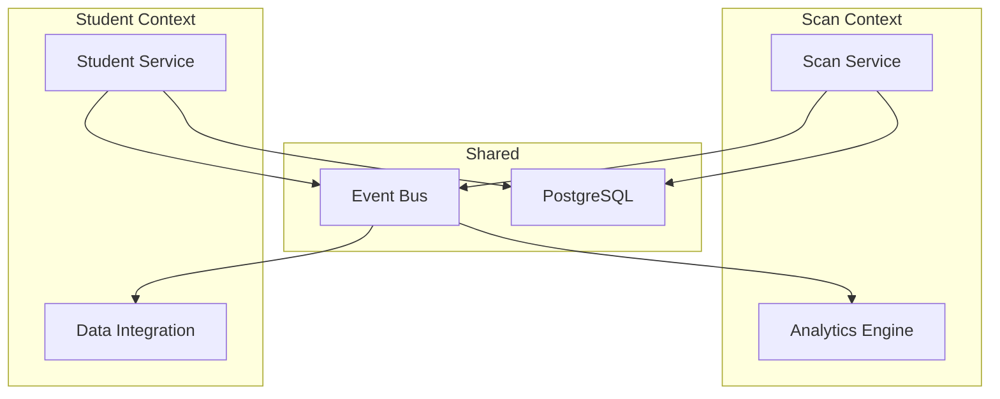

Event-driven microservices enable building scalable, maintainable systems that can handle complex business logic while remaining loosely coupled. In this post, I'll share lessons learned from building a production microservices platform serving 5,000+ users.

## Why FastAPI for Microservices?

FastAPI is an excellent choice for microservices due to its async capabilities, automatic OpenAPI documentation, and Pydantic validation. Combined with SQLAlchemy 2.0's async support, you can build high-performance services that handle hundreds of concurrent requests.

```python
from fastapi import FastAPI
from pydantic import BaseModel

app = FastAPI()

class Event(BaseModel):
    type: str
    data: dict

@app.post('/events')
async def handle_event(event: Event):
    return {'status': 'processed'}
```

## Domain-Driven Design Principles

Domain-Driven Design helps organize complex business logic into bounded contexts. Each microservice owns its domain model and communicates with others through well-defined interfaces. This isolation makes testing easier and allows teams to work independently.



> **Tip:** Use bounded contexts to isolate domains and enable independent team work. Each context should have clear boundaries and well-defined interfaces.

## Key Architecture Patterns

Several patterns are essential for building maintainable microservices: Repository pattern for data access, Adapter pattern for external integrations, dependency injection for testability, and CQRS for separating reads from writes. Use domain events to communicate between services rather than tight coupling.

### Repository Pattern Implementation

```python
from abc import ABC, abstractmethod
from sqlalchemy.ext.asyncio import AsyncSession

class EventRepository(ABC):
    @abstractmethod
    async def save(self, event: Event) -> None:
        pass

class SQLEventRepository(EventRepository):
    def __init__(self, session: AsyncSession):
        self.session = session

    async def save(self, event: Event) -> None:
        self.session.add(event)
        await self.session.commit()
```

## Observability is Critical

Instrument your services with Prometheus metrics, structured logging with Structlog, and distributed tracing with OpenTelemetry. This visibility is essential for debugging production issues.

> **Warning:** Without proper observability, you're flying blind. Always implement metrics, logging, and tracing from day one.

## Real-World Results

Our QR code platform processes 500+ daily interactions with sub-second response times using these patterns. Proper architecture enables scaling both the system and the team. The event-driven approach allowed us to maintain 99.9% uptime while continuously deploying new features.

> **Important:** Start with a solid architecture from the beginning. Refactoring a monolith into microservices is exponentially harder than building it right from day one.
