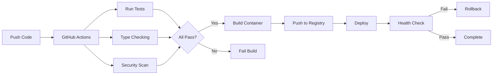

Continuous Integration and Continuous Deployment enable shipping features faster while maintaining quality. Here's how we built CI/CD pipelines that reduced deployment time from hours to minutes while serving 5,000+ users.

## Why GitHub Actions?

GitHub Actions provides powerful workflow automation directly integrated with your repository. Native integration means no external configuration, and the marketplace offers thousands of pre-built actions.



## Automated Testing Pipeline

Quality gates are essential. Your CI pipeline should catch issues before they reach production.


```yaml
name: Test

on:
  push:
    branches: [main, develop]
  pull_request:
    branches: [main]

jobs:
  test:
    runs-on: ubuntu-latest
    strategy:
      matrix:
        python-version: ['3.10', '3.11', '3.12']

    steps:
      - uses: actions/checkout@v4

      - name: Set up Python
        uses: actions/setup-python@v5
        with:
          python-version: ${{ matrix.python-version }}
          cache: 'pip'

      - name: Install dependencies
        run: |
          pip install -r requirements.txt
          pip install pytest pytest-cov mypy black ruff pip-audit

      - name: Run type checking
        run: mypy src/

      - name: Check formatting
        run: |
          black --check src/
          ruff check src/

      - name: Run security audit
        run: pip-audit

      - name: Run tests with coverage
        run: |
          pytest tests/ \
            --cov=src \
            --cov-report=xml \
            --cov-report=term \
            --cov-fail-under=80

      - name: Upload coverage
        uses: codecov/codecov-action@v3
        with:
          file: ./coverage.xml
```


> **Tip:** Use matrix builds to test across multiple Python versions. Catch compatibility issues before your users do.

## Optimized Container Builds

Multi-stage Docker builds minimize image size and improve security. Layer caching makes rebuilds fast.

```dockerfile
FROM python:3.11-slim as builder

WORKDIR /app

COPY requirements.txt .
RUN pip install --user --no-cache-dir -r requirements.txt

FROM python:3.11-slim

WORKDIR /app

COPY --from=builder /root/.local /root/.local
COPY src/ ./src/

RUN useradd -m -u 1000 appuser && chown -R appuser:appuser /app
USER appuser

ENV PATH=/root/.local/bin:$PATH

CMD ["python", "-m", "uvicorn", "src.main:app", "--host", "0.0.0.0", "--port", "8000"]
```


```yaml
name: Build and Push

on:
  push:
    branches: [main]
    tags: ['v*']

jobs:
  build:
    runs-on: ubuntu-latest
    permissions:
      contents: read
      packages: write

    steps:
      - uses: actions/checkout@v4

      - name: Set up Docker Buildx
        uses: docker/setup-buildx-action@v3

      - name: Log in to Registry
        uses: docker/login-action@v3
        with:
          registry: ghcr.io
          username: ${{ github.actor }}
          password: ${{ secrets.GITHUB_TOKEN }}

      - name: Extract metadata
        id: meta
        uses: docker/metadata-action@v5
        with:
          images: ghcr.io/${{ github.repository }}
          tags: |
            type=ref,event=branch
            type=semver,pattern={{version}}
            type=sha,prefix={{branch}}-

      - name: Build and push
        uses: docker/build-push-action@v5
        with:
          context: .
          push: true
          tags: ${{ steps.meta.outputs.tags }}
          labels: ${{ steps.meta.outputs.labels }}
          cache-from: type=gha
          cache-to: type=gha,mode=max

      - name: Scan image
        uses: aquasecurity/trivy-action@master
        with:
          image-ref: ${{ steps.meta.outputs.tags }}
          format: 'sarif'
          output: 'trivy-results.sarif'

      - name: Upload scan results
        uses: github/codeql-action/upload-sarif@v2
        with:
          sarif_file: 'trivy-results.sarif'
```


> **Warning:** Never use 'latest' tag in production. Always use specific versions or commit SHAs for reproducibility.

## Zero-Downtime Deployment

Rolling deployments ensure users never experience downtime. Health checks validate each instance before routing traffic.


```yaml
name: Deploy

on:
  workflow_run:
    workflows: ["Build and Push"]
    types: [completed]
    branches: [main]

jobs:
  deploy:
    runs-on: ubuntu-latest
    if: ${{ github.event.workflow_run.conclusion == 'success' }}

    steps:
      - uses: actions/checkout@v4

      - name: Run database migrations
        run: |
          docker run --rm \
            --network=production \
            -e DATABASE_URL=${{ secrets.DATABASE_URL }} \
            ghcr.io/${{ github.repository }}:${{ github.sha }} \
            alembic upgrade head

      - name: Deploy with rolling update
        run: |
          docker service update \
            --image ghcr.io/${{ github.repository }}:${{ github.sha }} \
            --update-parallelism 1 \
            --update-delay 30s \
            --update-order start-first \
            --health-cmd "curl -f http://localhost:8000/health || exit 1" \
            --health-interval 10s \
            --health-retries 3 \
            production_api

      - name: Wait for rollout
        run: |
          timeout 300 bash -c 'until [ "$(docker service ps production_api --filter desired-state=running -q | wc -l)" -eq "3" ]; do sleep 5; done'

      - name: Verify deployment
        run: |
          response=$(curl -f -s -o /dev/null -w "%{http_code}" https://api.example.com/health)
          if [ $response -ne 200 ]; then
            echo "Health check failed with status $response"
            docker service rollback production_api
            exit 1
          fi

      - name: Notify on failure
        if: failure()
        uses: slackapi/slack-github-action@v1
        with:
          webhook-url: ${{ secrets.SLACK_WEBHOOK }}
          payload: |
            {
              "text": "Deployment failed for ${{ github.repository }}",
              "blocks": [
                {
                  "type": "section",
                  "text": {
                    "type": "mrkdwn",
                    "text": "*Deployment Failed* :x:\nRepository: ${{ github.repository }}\nCommit: ${{ github.sha }}"
                  }
                }
              ]
            }
```


## Database Migrations

Always run migrations before deploying new code. Use Alembic for safe, versioned database changes.

```python
from alembic import op
import sqlalchemy as sa

def upgrade():
    op.add_column(
        'scans',
        sa.Column('status', sa.String(50), nullable=True)
    )

    op.execute(
        "UPDATE scans SET status = 'completed' WHERE status IS NULL"
    )

    op.alter_column('scans', 'status', nullable=False)

    op.create_index(
        'idx_scans_status',
        'scans',
        ['status']
    )

def downgrade():
    op.drop_index('idx_scans_status', table_name='scans')
    op.drop_column('scans', 'status')
```

> **Important:** Always write reversible migrations. You should be able to roll back any change without data loss.

## Monitoring and Observability

Track deployment metrics to understand pipeline health and identify bottlenecks.


```yaml
name: Deployment Metrics

on:
  workflow_run:
    workflows: ["Deploy"]
    types: [completed]

jobs:
  metrics:
    runs-on: ubuntu-latest
    steps:
      - name: Record deployment metrics
        run: |
          curl -X POST https://api.example.com/metrics \
            -H "Content-Type: application/json" \
            -d '{
              "metric": "deployment.completed",
              "value": 1,
              "tags": {
                "status": "${{ github.event.workflow_run.conclusion }}",
                "branch": "${{ github.ref_name }}",
                "duration": "${{ github.event.workflow_run.duration }}"
              }
            }'

      - name: Check error rate
        run: |
          error_rate=$(curl -s https://api.example.com/metrics/errors | jq '.rate')
          if (( $(echo "$error_rate > 0.05" | bc -l) )); then
            echo "Error rate too high: $error_rate"
            curl -X POST https://api.example.com/rollback \
              -H "Authorization: Bearer ${{ secrets.API_TOKEN }}"
            exit 1
          fi
```


## Real-World Results

Our CI/CD pipeline enables multiple deployments per day with confidence. Automated testing catches 95% of bugs before code review. Zero-downtime deployments ensure 5,000+ users never experience service interruptions.

> **Tip:** We reduced deployment time from 2 hours of manual work to 8 minutes of automated deployment. The ROI on CI/CD automation is immediate.

Key principle: automate everything, but make it easy to override when needed. The best pipelines are reliable, fast, and transparent. Developers should trust the pipeline and understand what it does at every step.

> **Important:** Start simple and iterate. A basic CI/CD pipeline that works is better than a complex one that's always breaking.
