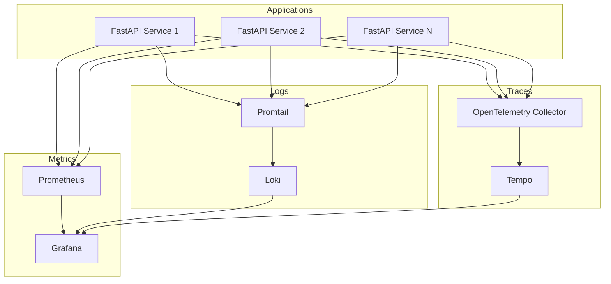

You can't fix what you can't see. Observability is essential for running production microservices. Here's how we built comprehensive monitoring infrastructure that provides visibility into every layer of our stack serving 5,000+ users.

> **Warning:** Observability is not optional. Without it, you're flying blind in production. Instrument from day one, not after the first incident.

## The Three Pillars of Observability

Complete observability requires three complementary approaches: metrics with Prometheus, logs with Grafana Loki, and traces with OpenTelemetry. Each provides different insights, and together they give you complete visibility into system behavior.



## Metrics with Prometheus

Prometheus collects time-series metrics from all services. Instrument your FastAPI applications with prometheus-client to expose custom metrics that matter to your business and operations.

```python
from prometheus_client import Counter, Histogram, generate_latest
from fastapi import FastAPI, Response
import time

app = FastAPI()

request_count = Counter(
    'http_requests_total',
    'Total HTTP requests',
    ['method', 'endpoint', 'status']
)

request_duration = Histogram(
    'http_request_duration_seconds',
    'HTTP request latency',
    ['method', 'endpoint']
)

@app.middleware('http')
async def prometheus_middleware(request, call_next):
    start = time.time()
    response = await call_next(request)
    duration = time.time() - start

    request_count.labels(
        method=request.method,
        endpoint=request.url.path,
        status=response.status_code
    ).inc()

    request_duration.labels(
        method=request.method,
        endpoint=request.url.path
    ).observe(duration)

    return response

@app.get('/metrics')
def metrics():
    return Response(content=generate_latest(), media_type='text/plain')
```

Track what matters: request rates, error rates, latency percentiles (p50, p95, p99), business metrics like scans processed, and resource utilization (CPU, memory, connections). Create dashboards in Grafana to visualize trends and set alerts for anomalies.

## Logs with Grafana Loki

Grafana Loki aggregates logs from all containers using Promtail. Use structured logging with Structlog to make logs searchable and correlatable. Include request IDs to trace requests across services.

```python
import structlog
import uuid
from fastapi import Request

structlog.configure(
    processors=[
        structlog.processors.TimeStamper(fmt='iso'),
        structlog.stdlib.add_log_level,
        structlog.processors.JSONRenderer()
    ],
    wrapper_class=structlog.stdlib.BoundLogger,
    logger_factory=structlog.stdlib.LoggerFactory(),
)

logger = structlog.get_logger()

@app.middleware('http')
async def logging_middleware(request: Request, call_next):
    request_id = str(uuid.uuid4())
    request.state.request_id = request_id

    logger.info(
        'request_started',
        request_id=request_id,
        method=request.method,
        path=request.url.path,
        client=request.client.host
    )

    response = await call_next(request)

    logger.info(
        'request_completed',
        request_id=request_id,
        status_code=response.status_code
    )

    return response
```

> **Tip:** Structured logging is a game-changer. JSON logs are searchable, parseable, and correlatable. Never go back to parsing text logs.

## Traces with OpenTelemetry

OpenTelemetry provides distributed tracing. See exactly how requests flow through your microservices, identify bottlenecks, and understand dependencies. The automatic instrumentation for FastAPI makes adoption straightforward.

```python
from opentelemetry import trace
from opentelemetry.instrumentation.fastapi import FastAPIInstrumentor
from opentelemetry.sdk.trace import TracerProvider
from opentelemetry.sdk.trace.export import BatchSpanProcessor
from opentelemetry.exporter.otlp.proto.grpc.trace_exporter import OTLPSpanExporter

trace.set_tracer_provider(TracerProvider())
tracer = trace.get_tracer(__name__)

otlp_exporter = OTLPSpanExporter(
    endpoint='http://otel-collector:4317',
    insecure=True
)
trace.get_tracer_provider().add_span_processor(
    BatchSpanProcessor(otlp_exporter)
)

FastAPIInstrumentor.instrument_app(app)

@app.post('/process')
async def process_data(data: dict):
    with tracer.start_as_current_span('validate_data'):
        pass

    with tracer.start_as_current_span('save_to_database'):
        pass

    return {'status': 'processed'}
```

## Docker Compose Setup

Deploy the complete monitoring stack with Docker Compose. This setup runs alongside your microservices and collects data automatically.

```yaml
version: '3.8'

services:
  prometheus:
    image: prom/prometheus:latest
    volumes:
      - ./prometheus.yml:/etc/prometheus/prometheus.yml
      - prometheus-data:/prometheus
    ports:
      - '9090:9090'
    command:
      - '--config.file=/etc/prometheus/prometheus.yml'
      - '--storage.tsdb.retention.time=30d'

  grafana:
    image: grafana/grafana:latest
    volumes:
      - grafana-data:/var/lib/grafana
      - ./grafana/dashboards:/etc/grafana/provisioning/dashboards
    ports:
      - '3000:3000'
    environment:
      - GF_SECURITY_ADMIN_PASSWORD=admin

  loki:
    image: grafana/loki:latest
    ports:
      - '3100:3100'
    volumes:
      - loki-data:/loki

  promtail:
    image: grafana/promtail:latest
    volumes:
      - /var/lib/docker/containers:/var/lib/docker/containers:ro
      - ./promtail.yml:/etc/promtail/config.yml
    command: -config.file=/etc/promtail/config.yml

volumes:
  prometheus-data:
  grafana-data:
  loki-data:
```

## Creating Effective Dashboards

Build Grafana dashboards that tell a story. Start with high-level metrics (request rate, error rate, latency) then drill down into service-specific details. Use variables to filter by service, environment, or time range.

> **Important:** The RED method: Rate, Errors, Duration. These three metrics give you 80% of what you need to know about service health.

## Alerting Rules

Set up Prometheus alerting rules for critical conditions. Alert on symptoms (user-facing issues) not causes. Group related alerts to avoid alert fatigue.


```yaml
groups:
  - name: api_alerts
    rules:
      - alert: HighErrorRate
        expr: |
          rate(http_requests_total{status=~"5.."}[5m])
          / rate(http_requests_total[5m]) > 0.05
        for: 5m
        labels:
          severity: critical
        annotations:
          summary: "High error rate detected"
          description: "Error rate is {{ $value | humanizePercentage }}"

      - alert: HighLatency
        expr: |
          histogram_quantile(0.95,
            rate(http_request_duration_seconds_bucket[5m])
          ) > 1
        for: 10m
        labels:
          severity: warning
        annotations:
          summary: "High request latency"
          description: "P95 latency is {{ $value }}s"
```


## Real-World Results

Our 11-service architecture processes 500+ daily interactions across 11+ database tables. With proper observability, we maintain 99.9% uptime and can debug issues in minutes instead of hours. When problems occur, we have the data to understand exactly what happened and why.

> **Tip:** Observability paid for itself the first time we used it to debug a production issue. What would have taken hours was resolved in 10 minutes.

The key is making observability a first-class concern from the start. Instrument your code, deploy the monitoring stack, create dashboards, and set up alerts. Your future self will thank you when the 3 AM page comes in and you can quickly identify and resolve the issue.
