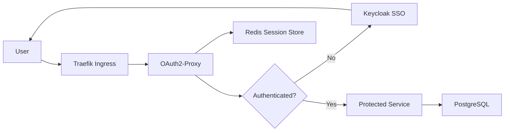

Modern web applications require robust authentication and authorization. A zero-trust architecture ensures every request is authenticated and authorized before accessing protected resources. Here's how we built an authentication gateway serving 5,181+ active users.

## The Zero-Trust Architecture

OAuth2-Proxy acts as a reverse proxy that handles authentication before requests reach your application. Combined with Traefik as the ingress controller, you can protect entire services with just configuration changes. This pattern keeps authentication logic out of individual applications.



## Keycloak for Centralized Identity

Keycloak provides centralized identity management with SSO capabilities. Users log in once and access multiple applications seamlessly. It supports various authentication methods, role-based access control, and integrates with existing identity providers.

```yaml
upstreams:
  - id: protected-service
    uri: http://backend:8000
    path: /

providers:
  - id: keycloak
    provider: oidc
    clientID: my-app
    clientSecret: ${CLIENT_SECRET}
    oidcConfig:
      issuerURL: https://keycloak.example.com/realms/myrealm
      audienceClaims:
        - aud
      emailClaim: email
      groupsClaim: groups
```

## Implementation Details

The implementation consists of several key components working together:

### OAuth2-Proxy Deployment

Deploy OAuth2-Proxy as a sidecar container alongside your application. Configure it to validate tokens with Keycloak and maintain session state in Redis for horizontal scalability.

### Traefik Middleware Configuration

```yaml
apiVersion: traefik.containo.us/v1alpha1
kind: Middleware
metadata:
  name: auth-middleware
spec:
  forwardAuth:
    address: http://oauth2-proxy:4180/oauth2/auth
    trustForwardHeader: true
    authResponseHeaders:
      - X-Auth-Request-User
      - X-Auth-Request-Email
      - X-Auth-Request-Groups
```

### Role-Based Access Control

Set up Keycloak realms and clients with appropriate roles. Implement RBAC by checking group membership in your application. OAuth2-Proxy passes user groups via headers for fine-grained authorization.

> **Warning:** Always validate authorization in your application layer, even with OAuth2-Proxy. Defense in depth is essential for security.

## Security Best Practices

Security must be built into every layer of your authentication system:

```yaml
headers:
  customResponseHeaders:
    Strict-Transport-Security: "max-age=63072000"
    X-Frame-Options: "DENY"
    X-Content-Type-Options: "nosniff"
    Referrer-Policy: "strict-origin-when-cross-origin"
    Permissions-Policy: "geolocation=(), microphone=(), camera=()"
  contentSecurityPolicy: "default-src 'self'; script-src 'self'; style-src 'self' 'unsafe-inline'"
```

Always use HTTPS in production. Implement CSRF protection for state-changing operations. Set proper CORS headers to prevent unauthorized cross-origin requests. Use short-lived access tokens (15 minutes) with refresh tokens for extended sessions. Monitor authentication failures and implement rate limiting to prevent brute force attacks.

> **Important:** Store session data in Redis with appropriate TTLs. Never store sensitive data in browser storage. Use httpOnly, secure, and sameSite cookies.

## Real-World Results

Our authentication gateway protects 11 microservices and serves 5,181+ active users. The zero-trust architecture ensures every request is validated while providing seamless SSO experience. Users authenticate once and access all applications without repeated logins.

> **Tip:** With proper monitoring, we detected and blocked 200+ unauthorized access attempts in the first month. Security monitoring is not optional.

The result: a secure, scalable authentication system that protects sensitive university data while providing seamless user experience across multiple applications. Response times remain under 100ms for authenticated requests, and the system scales horizontally to handle traffic spikes.
