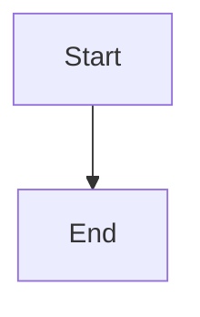

# Development Guide

> jaysinghdev Portfolio | Generated: 2026-01-28

## Prerequisites

| Requirement | Version | Purpose |
|-------------|---------|---------|
| Node.js | 18+ | JavaScript runtime |
| npm | 9+ | Package manager |

## Quick Start

```bash
# Clone the repository
git clone https://github.com/gsinghjay/jaysinghdev.git
cd jaysinghdev

# Install dependencies
npm install

# Start development server
npm run dev
```

The development server will start at `http://localhost:5173`

## Available Scripts

| Command | Description |
|---------|-------------|
| `npm run dev` | Start Vite dev server (auto-runs build:content) |
| `npm run build` | Production build (auto-runs build:content) |
| `npm run build:content` | Compile markdown to JSON |
| `npm run preview` | Preview production build locally |
| `npm run lint` | Run ESLint on TypeScript files |
| `npm run typecheck` | Run TypeScript compiler (no emit) |

## Project Structure

```
jaysinghdev/
├── content/           # ✏️ Editable content (blog, projects, config)
├── public/            # Static assets + build outputs
├── scripts/           # Build scripts
├── src/               # React application source
│   ├── components/    # Reusable UI components
│   ├── pages/         # Page-level components
│   ├── types/         # TypeScript interfaces
│   └── utils/         # Utility functions
├── docs/              # Generated documentation
└── [config files]     # Vite, TypeScript, Tailwind, ESLint
```

## Content Management

### Adding a Blog Post

1. Create a new markdown file in `content/blog/`:

```markdown
---
id: my-new-post
title: My New Blog Post
date: "2026-01-28"
excerpt: A brief description of the post
tags:
  - React
  - TypeScript
readTime: "5 min read"
featured: false
relatedProjectIds:
  - authentication-gateway
---

Your markdown content here...

## Section Heading

More content...

```typescript
// Code blocks are supported
const example = "Hello World";
```


```

2. Run `npm run build:content` to compile
3. The post will appear in the blog listing

### Adding a Project

1. Create a new markdown file in `content/projects/`:

```markdown
---
id: my-project
title: My Project Title
description: Short description for cards
technologies:
  - React
  - Node.js
  - PostgreSQL
liveUrl: https://example.com
githubUrl: https://github.com/user/repo
imageAlt: Project screenshot
featured: true
projectType: personal  # or 'work'
keyFeatures:
  - Feature one
  - Feature two
diagramType: mermaid  # or 'image'
diagramContent: |
  graph TD
    A --> B
diagramLabel: System Architecture
---

Project overview paragraph...

## Challenge

What problem did this solve?

## Solution

How did you solve it?

## Impact

What were the results?
```

2. Run `npm run build:content` to compile

### Updating Profile/Resume/Skills

Edit the YAML files in `content/config/`:

- `profile.yaml` - Name, role, bio, contact info
- `resume.yaml` - Experience, education, certifications
- `skills.yaml` - Technical skills by category

No build step needed - these are loaded at runtime.

## Development Workflow

### Making Changes

1. **Component changes** - Edit files in `src/`, hot reload is automatic
2. **Content changes** - Edit `content/`, run `npm run build:content`
3. **Style changes** - Edit Tailwind classes or `src/index.css`

### Code Style

The project uses:
- **ESLint** with TypeScript and React plugins
- **Strict TypeScript** mode
- **Tailwind CSS** for styling

Run `npm run lint` before committing.

### Type Checking

Run `npm run typecheck` to check for TypeScript errors without building.

## Build Process

### Content Build (`npm run build:content`)

```
content/blog/*.md ──┐
                    ├──► scripts/build-content.js ──► public/*.json
content/projects/*.md ─┘
```

The build script:
1. Reads all `.md` files from `content/blog/` and `content/projects/`
2. Parses YAML front matter with `gray-matter`
3. Converts markdown body to structured content blocks
4. Outputs `blog-posts.json` and `projects.json` to `public/`

### Production Build (`npm run build`)

```
npm run build:content  →  vite build  →  dist/
```

Output includes:
- Optimized JS/CSS bundles
- All static assets from `public/`
- Ready for static hosting

## Deployment

### Static Hosting Options

The built `dist/` folder can be deployed to:
- **Vercel** - Zero-config deployment
- **Netlify** - Zero-config deployment
- **GitHub Pages** - Requires base path config
- **AWS S3 + CloudFront** - Manual setup

### Environment Variables

Currently `.env` is empty. If adding Supabase:

```bash
# .env
VITE_SUPABASE_URL=your-project-url
VITE_SUPABASE_ANON_KEY=your-anon-key
```

Access in code via `import.meta.env.VITE_*`

## Troubleshooting

### Content Not Updating

```bash
# Rebuild content
npm run build:content

# Clear Vite cache
rm -rf node_modules/.vite
npm run dev
```

### TypeScript Errors

```bash
# Check types
npm run typecheck

# Common fix: restart TS server in VS Code
# Cmd/Ctrl + Shift + P → "TypeScript: Restart TS Server"
```

### Tailwind Classes Not Working

1. Check `tailwind.config.js` content paths
2. Ensure class is not being purged
3. Try restarting dev server

## Adding New Features

### New Page

1. Create page component in `src/pages/MyPage.tsx`
2. Add to `Page` type in `src/types/index.ts`
3. Add routing case in `src/App.tsx`
4. Add navigation link in `src/components/Header.tsx`

### New Component

1. Create in `src/components/MyComponent.tsx`
2. Define interface for props
3. Follow existing brutalist patterns
4. Export as default function

### New Content Type

1. Add interface in `src/types/index.ts`
2. Update `scripts/build-content.js` to process new type
3. Add loader function in `src/utils/content-loader.ts`
4. Create component to display the content

## Testing

Currently no test framework is configured. Recommendations:

- **Unit tests:** Vitest (Vite-native)
- **Component tests:** React Testing Library
- **E2E tests:** Playwright or Cypress

## Recommended VS Code Extensions

- ESLint
- Tailwind CSS IntelliSense
- TypeScript Vue Plugin (Volar) - for better TS support
- Prettier (optional, not configured in project)
